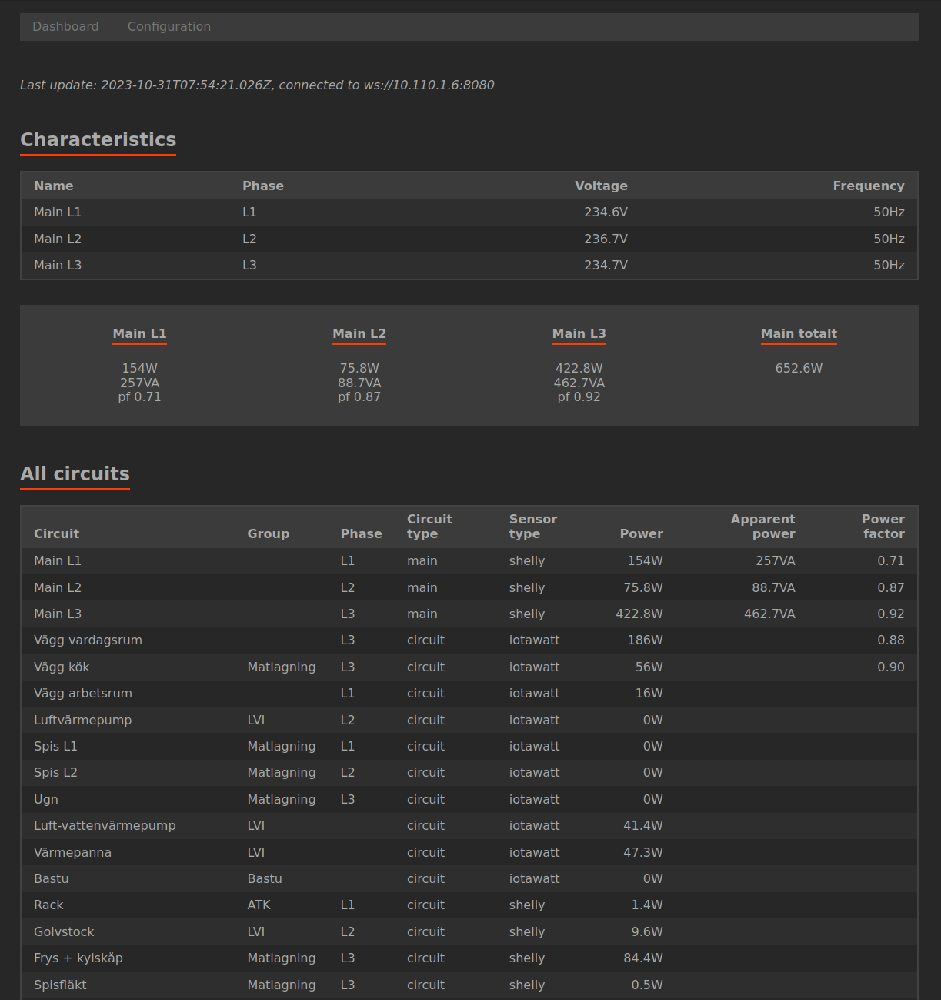
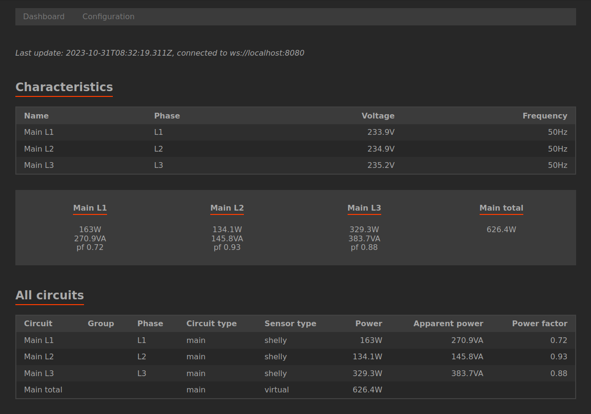
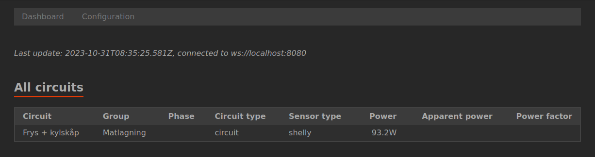
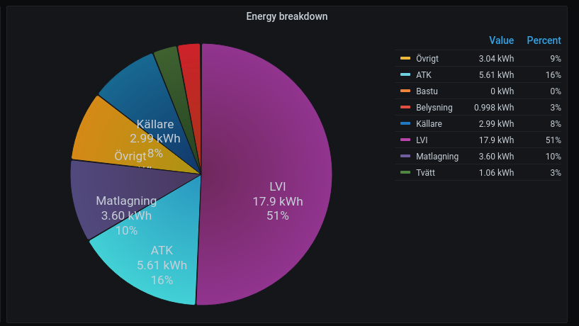
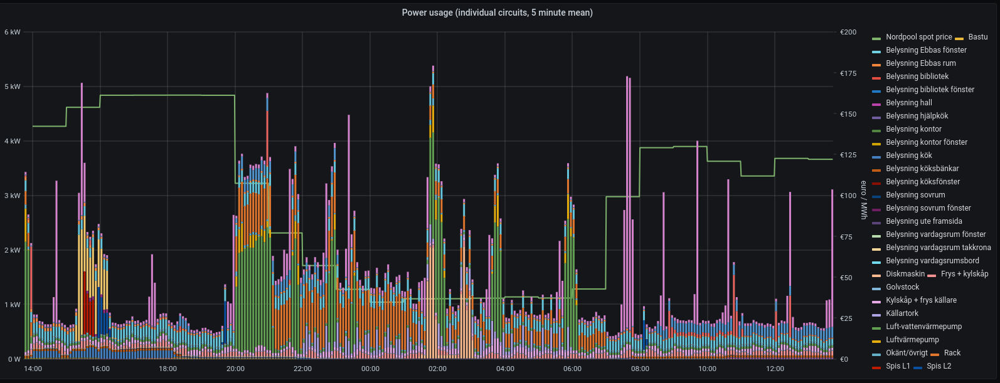

# eachwatt

[](https://github.com/Jalle19/eachwatt/actions/workflows/ci.yml)

> This software is still work-in-progress and the documentation is still pretty thin!

EachWatt is a versatile energy monitoring solution that is able to combine multiple types of power sensors and 
normalize the data. It enables users to get a comprehensive view of their home's energy usage without having to 
restrict them to a specific type of energy meter.

For example, a user may use a three-phase current transformer type sensor to measure mains power, then another 
current-transformer type sensor to measure certain branch circuits (like wall outlets or heavy fixed equipment like 
boilers and heat pumps), while complementing the measurements with smart plugs measuring individual devices' power 
consumption.

EachWatt is designed to be flexible and serve the needs of the user, rather than to force the user to conform to 
some specific way of measuring power. It's designed to integrate with other software by publishing the sensor readings 
to any number of different targets, such as databases or MQTT.

## Table of contents

* [Table of contents](#table-of-contents)
* [Features](#features)
* [Screenshots](#screenshots)
* [Installation and usage](#installation-and-usage)
  + [Running with Docker](#running-with-docker)
  + [Running as a systemd service](#running-as-a-systemd-service)
* [Caveats](#caveats)
* [Development](#development)
* [License](#license)

## Features

* Supports _**multiple different power sensors**_
  * [IotaWatt](http://iotawatt.com/)
  * [Shelly](https://www.shelly.com/) (both Gen 1 and Gen 2)
  * Generic Modbus sensors
* Supports _**virtual power sensors**_
  * A virtual power sensor gets its values from other configured sensors, enabling the user to calculate the total 
    power usage of three-phase devices or three-phase mains power
* Supports arbitrary _**grouping of devices**_
  * A group can be for example "Heating" or "Lights". This allows users to get a better overview of their energy 
    consumption when many circuits and devices are involved.
* Can apply various _**filters**_ to the power sensor data, such as:
  * Clamp values, useful for ignoring negative readings from bi-directional sensors
  * High-pass filtering, useful for ignoring tiny power readings
  * Scaling, often essential when dealing with Modbus sensors
* Can _**measure unmetered power**_ too
  * You can have a current-transformer type sensor measuring a circuit, then a smart plug measuring some specific 
    device on that circuit, then an unmetered type sensor which calculates the difference between the two, yielding the 
    power that wasn't measured by either of the two sensors.
* Can _**measure power characteristics**_
  * Characteristics mean voltage and frequency. Any number of characteristics sensors may be defined, and each phase 
    can theoretically be measured by a different device.
* Can _**publish the gathered data**_ to various targets
  * InfluxDB
    * Data can be published to InfluxDB, enabling users to chart their data using e.g. Grafana.
    * The `examples/` directory contains a ready-to-use [Flux task](examples/integrate_energy_hourly.task.flux) for regularly integrating power into energy
  * MQTT
    * Data can be published to MQTT, enabling any MQTT-enabled piece of software to receive the data in real-time
    * Optional Home Assistant auto-discovery support, meaning each configured sensor can be autoconfigured in Home 
      Assistant as separate entities
  * WebSocket
    * The built-in web interface communicates with the application using a WebSocket, which is also usable by other 
      software. This can be used to build e.g. custom web interfaces for wall-mounted displays

## Screenshots

Fully-fledged example:



Measuring just main circuits:



Minimal example (measuring single circuit only):



Examples of how the data published to InfluxDB can be visualized:




## Installation and usage

There are three ways of running the application:
* using Docker (recommended for end-users)
* natively as a systemd service (recommended for advanced users or people who don't want to use Docker)
* manually, mainly for developers

Ultimately the application requires a configuration file in order to run. Example configurations file can be found in 
the [examples/](examples/) directory.

### Running with Docker

Pull the latest image:

```bash
docker pull ghcr.io/jalle19/eachwatt:latest
```

Run the container:

```bash
docker run --rm -v $(pwd):/data:ro -p 8080:8080 ghcr.io/jalle19/eachwatt:latest
```

The application expects the configuration file to be available as `/data/config.yml`, so in the above example, 
`config.yml` should be present in the current directory.

### Running as a systemd service

There is a skeleton systemd service available in [systemd/eachwatt.service](systemd/eachwatt.service). Clone the 
project to `/opt/eachwatt`, copy the service file to `/etc/systemd/system/eachwatt.service`, modify it as necessary 
and then start the service using `systemctl start eachwatt.service`.

## Caveats

* IotaWatt input sensors are always whole numbers, i.e. 2 watts. Output sensors don't have this limitation.

## Development

Install dependencies:

```bash
npm i
```

Build and start the application:

```bash
npm run build && node dist/eachwatt.js -c config.yml
```

Install web interface dependencies:

```
cd webif/
npm i
```

Run the development server:

```
npm run dev -- --open
```

The web interface tries to open a WebSocket to the same host it's being served from, which is wrong when running the 
development server. Override the WebSocket URL using the `ws` query parameter, like this:

```
http://localhost:5173/?ws=ws://localhost:8080
```

To run the test suite, use:

```
npm run test
```

## License

This application is licensed under the GNU GENERAL PUBLIC LICENSE version 3 or later
